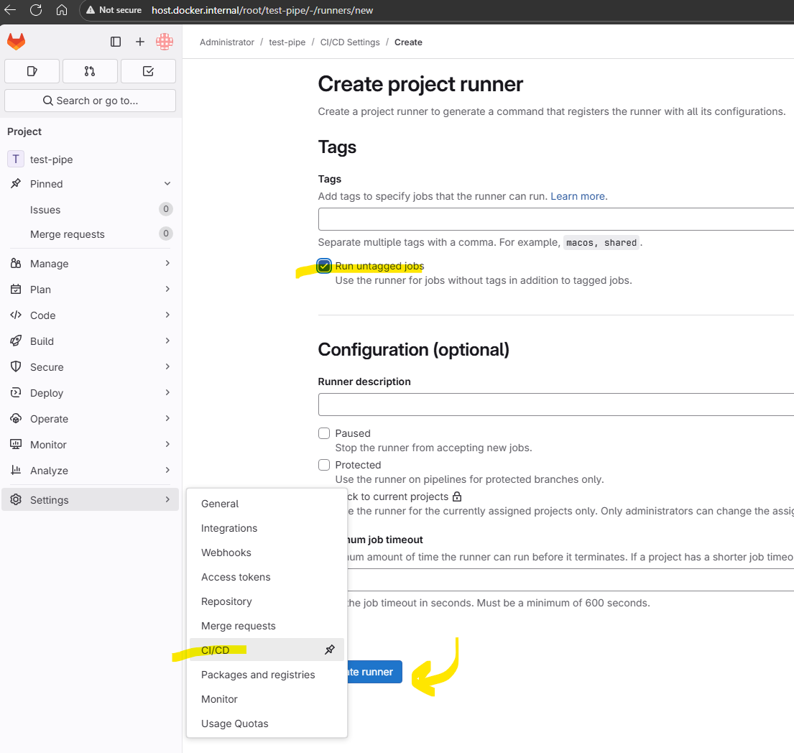
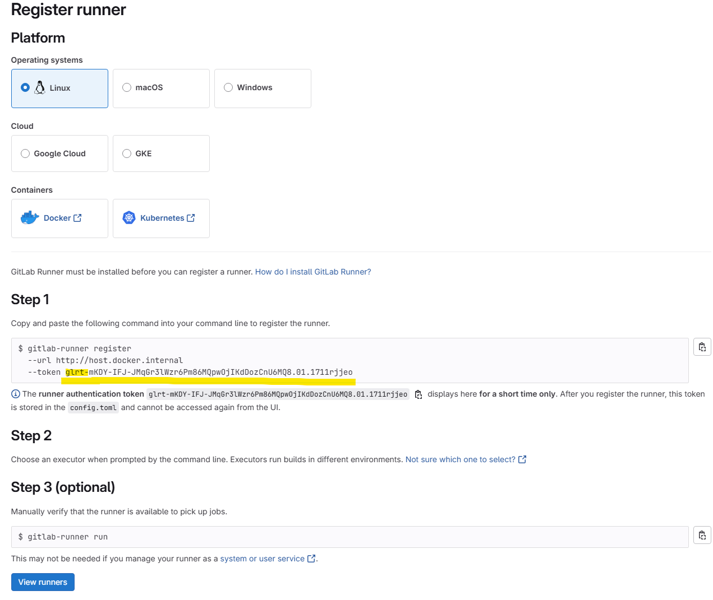
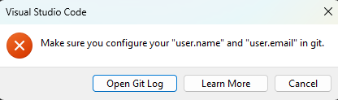

# 🚀 **Lab 0: GitLab Self-Hosting with Docker** (30 minutes)

## 🎯 Learning Objectives

Set up a local GitLab instance for hands-on CI/CD learning:
- **Self-hosted GitLab CE** running locally
- **Foundation for all subsequent labs** in this tutorial
- **Unlimited private repositories** and CI/CD minutes

## 📋 Prerequisites

### Required
- **Docker Desktop** installed and running
- **8GB+ RAM** available to Docker
- **20GB+ disk space**

### Check Prerequisites
```bash
docker --version    # Should show version 20.0+
docker info         # Should show Docker running
```

## 🚀 Quick Start (Confirmed Working)

### Method 1: Docker Compose (Recommended)
```bash
# Navigate to lab directory
cd labs/lab-00-gitlab-self-host-docker

# Start GitLab
docker-compose up -d

# Wait 3-5 minutes, then access GitLab at:
# http://host.docker.internal
```

### Method 2: Single Docker Command
```bash
docker run --detach \
  --hostname gitlab.local \
  --publish 443:443 --publish 80:80 --publish 22:22 \
  --name gitlab \
  --restart always \
  --volume gitlab_config:/etc/gitlab \
  --volume gitlab_logs:/var/log/gitlab \
  --volume gitlab_data:/var/opt/gitlab \
  --shm-size 256m \
  gitlab/gitlab-ce:latest
```

## ✅ Verify GitLab is Starting

### Check Container Status
```bash
# Should show "Up X minutes (health: starting)" then "(healthy)"
docker-compose ps
```

### Test Connection (After 3-5 minutes)
```bash
# Should return HTTP 302 redirect to sign-in page
curl -I http://host.docker.internal
```

**Expected Response:**
```
HTTP/1.1 302 Found
Server: nginx
Location: http://host.docker.internal/users/sign_in
X-Gitlab-Meta: {"correlation_id":"...","version":"1"}
```

## 🔐 Initial Setup

### 1. Get Root Password
```bash
# After GitLab starts (3-5 minutes), get the initial password:
docker-compose exec gitlab cat /etc/gitlab/initial_root_password

# Look for the line that says:
# Password: [your-password-here]
```

### 2. First Login
1. Open **http://localhost** in your browser
2. Username: **root**
3. Password: Use the password from step 1
4. **Change the password immediately** after first login
      ⚠️ **If password file doesn't exist** (already been configured), reset the root password:
       ```bash
       docker-compose exec gitlab gitlab-rails runner "user = User.find(1); user.password = 'newpassword123'; user.password_confirmation = 'newpassword123'; user.save!"
       ```

### 3. Create Your First Project
1. Click **New project** → **Create blank project**
2. Project name: `test-project`
3. Visibility Level: **Private**
4. Initialize with README: ✅

### 4. Install GitLab Runner (Optional)
For CI/CD pipelines, install a GitLab Runner:

**Windows (Git Bash/PowerShell):**
```bash
# Create config directory (use Docker volume to avoid Windows path issues)
docker volume create gitlab-runner-config

# Install GitLab Runner
docker run -d --name gitlab-runner --restart always \
  -v gitlab-runner-config:/etc/gitlab-runner \
  -v /var/run/docker.sock:/var/run/docker.sock \
  gitlab/gitlab-runner:latest
```

**Linux/macOS:**
```bash
# Create config directory
mkdir -p ~/gitlab-runner/config

# Install GitLab Runner
docker run -d --name gitlab-runner --restart always \
  -v ~/gitlab-runner/config:/etc/gitlab-runner \
  -v /var/run/docker.sock:/var/run/docker.sock \
  gitlab/gitlab-runner:latest
```

**Register the Runner** (after creating a project):
1. Go to your project → Settings → CI/CD → Runners
2. Click "New project runner" → Create runner → Copy the `glrt-` token


3. Register the runner interactively:
```bash
docker exec -it gitlab-runner gitlab-runner register
```

When prompted, enter:
- **GitLab instance URL:** `http://host.docker.internal`
- **Registration token:** Your `glrt-` token from step 2
- **Runner name:** `gitlab-runner` (or press Enter for default)
- **Executor:** `docker`
- **Default Docker image:** `alpine:latest`

**Expected output:**
```
Runner registered successfully. Feel free to start it, but if it's running already the config should be automatically reloaded!
Configuration (with the authentication token) was saved in "/etc/gitlab-runner/config.toml"
```

**🔧 Fix Clone URL Issue (if pipelines fail with "Could not resolve host: gitlab.local"):**

If your pipeline fails with DNS resolution errors, re-register the runner with the correct clone URL:

```bash
# Unregister current runner
docker exec gitlab-runner gitlab-runner unregister --all-runners

# Re-register with clone URL fix (replace YOUR_GLRT_TOKEN with your actual token)
docker exec gitlab-runner gitlab-runner register \
  --url http://host.docker.internal \
  --token YOUR_GLRT_TOKEN \
  --executor docker \
  --docker-image alpine:latest \
  --description "Local Docker Runner" \
  --clone-url http://host.docker.internal \
  --non-interactive
```

### 5. Clone Your Project
When cloning repositories from your local GitLab instance, use `localhost` instead of `gitlab.local`:

```bash
# Correct way to clone from local GitLab
git clone http://localhost/root/your-project-name.git

# Alternative options if localhost doesn't work:
# Option 1: Add to hosts file (127.0.0.1 gitlab.local)
git clone http://gitlab.local/root/your-project-name.git

# Option 2: Use container IP directly
# First find IP: docker inspect lab-00-gitlab-self-host-docker-gitlab-1 | grep IPAddress
git clone http://CONTAINER_IP/root/your-project-name.git
```

## 🛠️ Management Commands

```bash
# Start GitLab
docker-compose up -d

# Stop GitLab  
docker-compose down

# View startup logs
docker-compose logs -f gitlab

# Restart GitLab
docker-compose restart gitlab

# Check GitLab services status
docker-compose exec gitlab gitlab-ctl status

# Remove everything (careful - deletes all data!)
docker-compose down -v
```

## 🔍 Troubleshooting

### GitLab Not Accessible After 5+ Minutes

**Check container status:**
```bash
docker-compose ps
# Should show: Up X minutes (healthy)
```

**Check logs for errors:**
```bash
docker-compose logs gitlab | tail -50
```

**Test connection:**
```bash
curl -I http://host.docker.internal
# Should return HTTP 302, not connection refused
```

### Common Issues

**"Connection refused" or "Connection reset":**
- Wait longer - GitLab takes 3-5 minutes to start
- On slower systems, it can take up to 10 minutes

**Docker Desktop Issues (Windows):**
- Restart Docker Desktop as Administrator
- Ensure WSL2 backend is enabled
- Allocate at least 8GB memory: Docker Desktop → Settings → Resources

**Firewall Issues:**
- Windows Firewall may block ports 80/443
- Add Docker Desktop to firewall exceptions
- Or temporarily disable firewall for testing

**Git Commit Issues**



    1. Set local git configuration (repository-specific, won't affect global config):
      - git config --local user.name "Developer"
      - git config --local user.email "developer@localhost"
    2. Add untracked file to commit:
      - git add CLAUDE.md
    3. Create commit:
      - git commit -m "Add GitLab CI/CD pipeline and documentation"
    4. Push to local GitLab CE server:
      - git push origin main

## 🎉 Success Indicators

When GitLab is ready, you should see:
- ✅ **Container status**: `Up X minutes (healthy)`
- ✅ **HTTP test**: Returns `HTTP/1.1 302 Found`
- ✅ **Browser access**: GitLab sign-in page at http://localhost
- ✅ **Login works**: Can log in with root account

## 📚 Next Steps

1. **Change root password** immediately after first login
2. **Create a test project** to verify functionality  
3. **Proceed to Lab 1**: [Basic Pipeline Setup](../lab-01-basic-pipeline/)

---

## 📝 Notes

- GitLab uses **named volumes** for data persistence
- Data persists between container restarts
- To completely remove GitLab: `docker-compose down -v`
- The `gitlab-data/` directory in this folder is from failed attempts and can be ignored

**Questions?** Check GitLab's [official Docker installation guide](https://docs.gitlab.com/ee/install/docker.html).