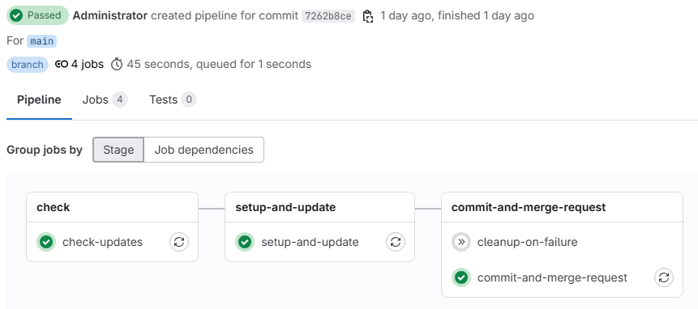
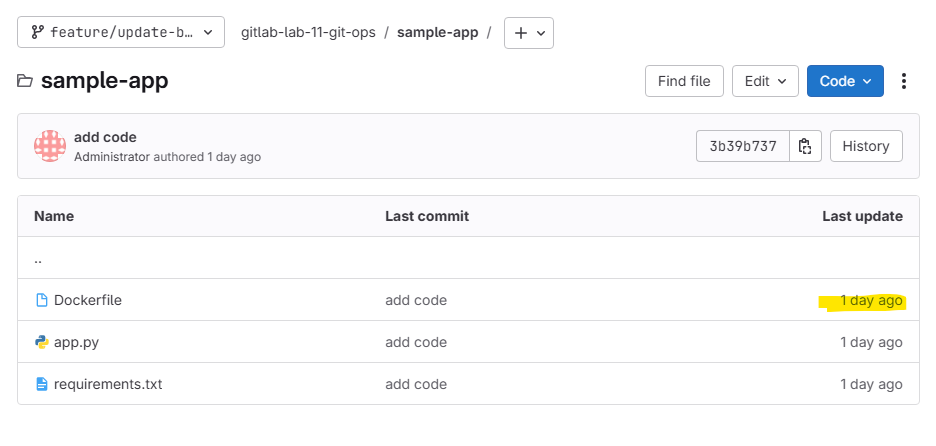
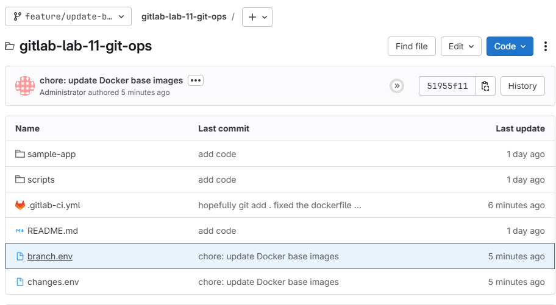

# Lab 11: Git Branch Operations from GitLab CI/CD Pipeline

## Overview

This lab demonstrates advanced GitLab CI/CD techniques for automating git branch operations, including feature branch creation, code modification, commits, and merge request creation directly from CI/CD pipelines. This is particularly useful for automated dependency updates, security patches, and maintenance tasks.

**🎯 This lab has been converted into a reusable GitLab CI/CD Component!** See the [GitLab Component Usage](#gitlab-component-usage) section for how to use this functionality in your own projects.

## Learning Objectives

After completing this lab, you will understand:

- How to create and manage feature branches from CI/CD pipelines
- Secure authentication methods using ACCESS_TOKEN for git operations
- Automated code modification techniques using shell scripting
- GitLab API integration for merge request creation
- Best practices for preventing infinite pipeline loops
- Docker base image update automation patterns

## Prerequisites

- Basic understanding of GitLab CI/CD pipelines
- Familiarity with Git commands and workflow
- Docker and Dockerfile knowledge
- Shell scripting basics
- Access to a GitLab instance (GitLab.com or self-hosted)

## Lab Structure

```
labs/lab-11-git-ops/
├── .gitlab-ci.yml              # Main CI/CD pipeline configuration
├── README.md                   # This documentation
├── sample-app/                 # Sample application for testing
│   ├── Dockerfile             # Sample Dockerfile with base images
│   ├── app.py                 # Simple Flask application
│   └── requirements.txt       # Python dependencies
├── scripts/                   # Original utility scripts
│   ├── create-sample-files.sh # Script to create sample files
│   └── update-image.sh        # Script to update base images
└── templates/                 # GitLab Component (NEW!)
    └── docker-image-updater/
        ├── template.yml       # Component pipeline template
        └── scripts/           # Enhanced component scripts
            ├── docker-image-handler.sh
            ├── create-sample-files.sh
            └── update-image.sh
```

## Setup Instructions

### Windows 11 / WSL Setup

#### 1. Install WSL2 (if not already installed)

```powershell
# Run in PowerShell as Administrator
wsl --install
# Restart computer if needed
```

#### 2. Install Required Tools in WSL

```bash
# Update package list
sudo apt update

# Install Git
sudo apt install git -y

# Install Docker (optional, for local testing)
curl -fsSL https://get.docker.com -o get-docker.sh
sudo sh get-docker.sh
sudo usermod -aG docker $USER

# Install curl and jq for API calls
sudo apt install curl jq -y
```

#### 3. Configure Git

```bash
# Set up your Git identity
git config --global user.name "Your Name"
git config --global user.email "your.email@example.com"

# Generate SSH key for GitLab (optional)
ssh-keygen -t ed25519 -C "your.email@example.com"
```

### GitLab Project Setup

#### 1. Create GitLab Project

1. Log into your GitLab instance
2. Create a new project called `gitlab-lab-11-git-ops`
3. Initialize with a README.md

#### 2. Create Access Token

1. Go to Project Settings → Access Tokens
2. Create a token with the following scopes:
   - `api` (for merge request creation)
   - `read_repository` 
   - `write_repository`
3. Save the token securely

#### 3. Configure CI/CD Variables

Go to Project Settings → CI/CD → Variables and add:

| Variable | Value | Protected | Masked |
|----------|-------|-----------|---------|
| `ACCESS_TOKEN` | Your GitLab access token | ✓ | ✓ |
| `GITLAB_USER_ID` | Your GitLab user ID | ✗ | ✗ |

To find your user ID:
```bash
curl --header "PRIVATE-TOKEN: YOUR_TOKEN" \
     "https://gitlab.com/api/v4/user"
```

## Implementation Details

### Pipeline Stages

#### 1. Setup Stage (`setup-branch`)
- Creates a new feature branch with unique naming
- Configures Git with proper credentials
- Uses OAuth2 authentication with ACCESS_TOKEN

```bash
REPO_URL="$(echo ${CI_PROJECT_URL} | sed 's|://|://oauth2:'${ACCESS_TOKEN}'@|')"
```

#### 2. Update Images Stage (`update-docker-images`)
- Checks out the feature branch created in the setup stage
- Shows current branch and Dockerfile content for debugging
- Updates base image versions using sed commands (python:3.9-slim → python:3.11-slim)
- Creates sample files if none exist
- Stages changes and sets CHANGES_MADE flag based on actual staged changes

#### 3. Commit Changes Stage (`commit-changes`)
- Checks out the feature branch and verifies staged changes exist
- Commits modified files with descriptive multi-line messages
- Pushes to feature branch with `ci.skip` to prevent loops
- Only runs if changes are detected (skips if no staged changes)

#### 4. Create Merge Request Stage (`create-merge-request`)
- Only runs if CHANGES_MADE=true from previous stage
- Uses GitLab API with proper JSON formatting to create merge requests
- Includes concise description and pipeline metadata
- Automatically sets remove_source_branch flag for cleanup

### Security Features

#### OAuth2 Authentication
The pipeline uses GitLab's OAuth2 authentication method:

```bash
REPO_URL="$(echo ${CI_PROJECT_URL} | sed 's|://|://oauth2:'${ACCESS_TOKEN}'@|')"
git remote set-url origin "${REPO_URL}"
```

This approach is recommended over SSH keys for CI/CD environments because:
- Easier to manage and rotate
- Scoped permissions
- Better audit trail

#### Preventing Infinite Loops
The pipeline uses `ci.skip` option when pushing:

```bash
git push origin "${FEATURE_BRANCH}" -o ci.skip
```

This prevents the push from triggering another pipeline run.

#### Protected Variables
All sensitive variables are marked as protected and masked in GitLab.

## Running the Lab

### Method 1: Automatic Trigger (Main Branch)

1. Ensure you're on the main branch
2. The pipeline will automatically run on pushes to main
3. Monitor the pipeline execution in GitLab CI/CD → Pipelines

### Method 2: Manual Trigger

1. Go to GitLab CI/CD → Pipelines
2. Click "Run Pipeline"
3. Select the branch (usually `main`)
4. Click "Run Pipeline"

### Method 3: API Trigger

```bash
curl --request POST \
     --form token=YOUR_TRIGGER_TOKEN \
     --form ref=main \
     https://gitlab.com/api/v4/projects/PROJECT_ID/trigger/pipeline
```

## Expected Outcomes

After a successful pipeline run:

1. **New Feature Branch**: A branch named `feature/update-base-images-{PIPELINE_ID}` is created
2. **Updated Files**: Dockerfiles have updated base image versions
3. **Commit**: Changes are committed with a descriptive message
4. **Merge Request**: An MR is automatically created and assigned

### Sample Output

```
Pipeline ID: 123456
Feature Branch: feature/update-base-images-123456
Changes: 
  - sample-app/Dockerfile: python:3.9-slim → python:3.11-slim
Merge Request: !42 - "chore: update Docker base images (automated)"
```


## Troubleshooting

### Common Issues

#### 1. Authentication Errors
```
fatal: Authentication failed for 'https://gitlab.com/...'
```

**Solution**: 
- Verify ACCESS_TOKEN is correctly set and has proper scopes
- Check token expiration date
- Ensure token has `api`, `read_repository`, and `write_repository` scopes

#### 2. Permission Denied
```
remote: You are not allowed to push code to protected branch
```

**Solution**:
- Verify the feature branch name doesn't conflict with protected branches
- Check project permissions for the user/token

#### 3. Pipeline Loops
```
Pipeline keeps triggering itself
```

**Solution**:
- Ensure `ci.skip` option is used: `git push -o ci.skip`
- Check pipeline rules to exclude merge request events

#### 4. Merge Request Creation Fails
```
422 Unprocessable Entity
```

**Solution**:
- Verify GITLAB_USER_ID is set correctly
- Check if a MR already exists for the branch
- Ensure proper API permissions

#### 5. curl Command Syntax Errors
```
curl: option -: is unknown
```

**Solution**:
- Check JSON formatting in curl command data payload
- Ensure multi-line strings are properly escaped
- Verify variable expansion doesn't break JSON structure
- Use proper double quotes and escaping: `\"field\": \"${VAR}\"`

#### 6. No Changes Detected
```
No changes made to Dockerfile
```

**Solution**:
- Verify sed patterns match actual file content (e.g., `python:3.9-slim` not `python:3.9`)
- Check file paths are correct relative to working directory
- Ensure the target branch has the expected files

---

# GitLab Component Usage

## 🚀 Using the Docker Image Updater Component

This lab has been converted into a reusable GitLab CI/CD Component that can be easily integrated into any project. The component automates Docker base image updates with feature branch creation and merge request automation.

### Quick Start

Add the following to your project's `.gitlab-ci.yml`:

```yaml
include:
  - component: your-gitlab-instance.com/path/to/this-project/docker-image-updater@latest

# Use the component with default settings
docker-update-workflow:
  extends: .docker-image-updater
```

### Component Inputs

Configure the component by providing inputs:

```yaml
include:
  - component: your-gitlab-instance.com/path/to/this-project/docker-image-updater@latest
    inputs:
      update_mode: "simple"                    # "api" or "simple"
      base_branch: "main"                     # Target branch for MRs
      dockerfile_path: "Dockerfile"           # Path to Dockerfile
      version_mappings: |                     # Custom version mappings
        python:3.9->3.11
        node:16->18
        alpine:3.15->3.18
      enable_mr_creation: true                # Auto-create merge requests
      access_token_variable: "ACCESS_TOKEN"   # Token variable name
```

### Available Modes

#### 1. API Mode (Default)
Uses Docker Hub API to automatically detect the latest versions:

```yaml
inputs:
  update_mode: "api"
  docker_images_api: |
    python:^[0-9]+\.[0-9]+(\.[0-9]+)?-slim$:-V:Python slim
    node:^[0-9]+$:-n:Node.js LTS
    alpine:^[0-9]+\.[0-9]+(\.[0-9]+)?$:-V:Alpine
```

#### 2. Simple Mode
Uses predefined version mappings for predictable updates:

```yaml
inputs:
  update_mode: "simple"
  version_mappings: |
    python:3.9->3.11
    python:3.10->3.11
    node:16->18
    node:17->18
```

### Complete Example

```yaml
# .gitlab-ci.yml in your project
include:
  - component: your-gitlab-instance.com/path/to/this-project/docker-image-updater@latest
    inputs:
      update_mode: "simple"
      base_branch: "main"
      feature_branch_prefix: "chore/update-docker-images"
      dockerfile_path: "docker/Dockerfile"
      version_mappings: |
        # Python updates
        python:3.9->3.11
        python:3.10->3.11
        # Node.js updates  
        node:16->18
        node:17->18
        # Alpine updates
        alpine:3.15->3.18
        # Custom images
        nginx:1.20->1.24
      enable_sample_creation: false
      enable_mr_creation: true
      enable_detailed_output: false
      run_on_main_only: true
      allow_manual_trigger: true
      access_token_variable: "GITLAB_ACCESS_TOKEN"

stages:
  - check-updates
  - setup-and-update  
  - commit-and-merge-request

# The component will automatically add the required jobs
```

### Required Variables

Set these in your project's CI/CD variables:

| Variable | Description | Required | Masked |
|----------|-------------|----------|---------|
| `ACCESS_TOKEN` (or custom name) | GitLab token with API access | ✓ | ✓ |

### Component Features

- **🔍 Smart Detection**: Automatically detects when updates are needed
- **🌿 Branch Management**: Creates feature branches with unique names
- **🔄 Flexible Updates**: Supports both API-driven and mapping-based updates
- **📝 Auto-Commit**: Commits changes with descriptive messages
- **🔗 Merge Requests**: Automatically creates MRs with proper descriptions
- **🧹 Cleanup**: Handles failure cases and branch cleanup
- **⚙️ Configurable**: Extensive customization options
- **🛡️ Secure**: Proper token handling and authentication

### Migration from Lab to Component

If you're already using the lab pipeline, here's how to migrate:

1. **Remove the old `.gitlab-ci.yml`** content
2. **Replace with component include**:
   ```yaml
   include:
     - component: path/to/docker-image-updater@latest
   ```
3. **Configure inputs** based on your current settings
4. **Update CI/CD variables** if using different names

### Component Development

The component structure follows GitLab's component standards:

```
templates/docker-image-updater/
├── template.yml              # Main component template
└── scripts/                  # Supporting scripts
    ├── docker-image-handler.sh
    ├── create-sample-files.sh
    └── update-image.sh
```

### Troubleshooting Component Issues

#### Component Not Found
```
Component not found: path/to/docker-image-updater
```

**Solution**:
- Verify the component path and version
- Ensure the project containing the component is accessible
- Check if the component project has proper visibility settings

#### Input Validation Errors
```
Invalid input value for 'update_mode'
```

**Solution**:
- Check input names and allowed values in the component spec
- Verify YAML syntax in input values
- Ensure multi-line strings use proper YAML format

#### Permission Errors
```
You don't have permission to access this component
```

**Solution**:
- Verify project visibility and access permissions
- Ensure the component project allows component access
- Check group/project membership requirements

---

## Original Lab Conclusion

This lab provides a comprehensive foundation for automating git operations from GitLab CI/CD pipelines. The key takeaways are:
- Secure authentication using ACCESS_TOKEN
- Proper pipeline design to prevent loops
- GitLab API integration for automation
- Shell scripting for file manipulation
- Git best practices in CI/CD contexts
- **Component creation and reusability patterns**

By mastering these techniques, you can significantly reduce manual maintenance overhead and improve the reliability of your software delivery processes. The component approach allows you to share this automation across multiple projects and teams.


