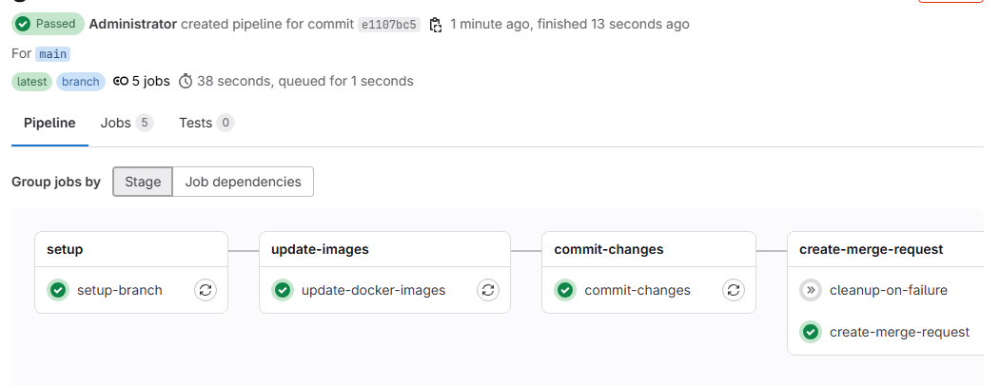

# Lab 11: Git Branch Operations from GitLab CI/CD Pipeline

## Overview

This lab demonstrates advanced GitLab CI/CD techniques for automating git branch operations, including feature branch creation, code modification, commits, and merge request creation directly from CI/CD pipelines. This is particularly useful for automated dependency updates, security patches, and maintenance tasks.

## Learning Objectives

After completing this lab, you will understand:

- How to create and manage feature branches from CI/CD pipelines
- Secure authentication methods using ACCESS_TOKEN for git operations
- Automated code modification techniques using shell scripting
- GitLab API integration for merge request creation
- Best practices for preventing infinite pipeline loops
- Docker base image update automation patterns

## Prerequisites

- Basic understanding of GitLab CI/CD pipelines
- Familiarity with Git commands and workflow
- Docker and Dockerfile knowledge
- Shell scripting basics
- Access to a GitLab instance (GitLab.com or self-hosted)

## Lab Structure

```
labs/lab-11-git-ops/
├── .gitlab-ci.yml              # Main CI/CD pipeline configuration
├── README.md                   # This documentation
├── sample-app/                 # Sample application for testing
│   ├── Dockerfile             # Sample Dockerfile with base images
│   ├── app.py                 # Simple Flask application
│   └── requirements.txt       # Python dependencies
└── scripts/                   # Utility scripts
    ├── create-sample-files.sh # Script to create sample files
    └── update-image.sh        # Script to update base images
```

## Setup Instructions

### Windows 11 / WSL Setup

#### 1. Install WSL2 (if not already installed)

```powershell
# Run in PowerShell as Administrator
wsl --install
# Restart computer if needed
```

#### 2. Install Required Tools in WSL

```bash
# Update package list
sudo apt update

# Install Git
sudo apt install git -y

# Install Docker (optional, for local testing)
curl -fsSL https://get.docker.com -o get-docker.sh
sudo sh get-docker.sh
sudo usermod -aG docker $USER

# Install curl and jq for API calls
sudo apt install curl jq -y
```

#### 3. Configure Git

```bash
# Set up your Git identity
git config --global user.name "Your Name"
git config --global user.email "your.email@example.com"

# Generate SSH key for GitLab (optional)
ssh-keygen -t ed25519 -C "your.email@example.com"
```

### GitLab Project Setup

#### 1. Create GitLab Project

1. Log into your GitLab instance
2. Create a new project called `gitlab-lab-11-git-ops`
3. Initialize with a README.md

#### 2. Create Access Token

1. Go to Project Settings → Access Tokens
2. Create a token with the following scopes:
   - `api` (for merge request creation)
   - `read_repository` 
   - `write_repository`
3. Save the token securely

#### 3. Configure CI/CD Variables

Go to Project Settings → CI/CD → Variables and add:

| Variable | Value | Protected | Masked |
|----------|-------|-----------|---------|
| `ACCESS_TOKEN` | Your GitLab access token | ✓ | ✓ |
| `GITLAB_USER_ID` | Your GitLab user ID | ✗ | ✗ |

To find your user ID:
```bash
curl --header "PRIVATE-TOKEN: YOUR_TOKEN" \
     "https://gitlab.com/api/v4/user"
```

## Implementation Details

### Pipeline Stages

#### 1. Setup Stage (`setup-branch`)
- Creates a new feature branch with unique naming
- Configures Git with proper credentials
- Uses OAuth2 authentication with ACCESS_TOKEN

```yaml
REPO_URL: "https://oauth2:${ACCESS_TOKEN}@${CI_PROJECT_URL#https://}.git"
```

#### 2. Update Images Stage (`update-docker-images`)
- Scans for Dockerfiles in the project
- Updates base image versions using sed commands
- Creates sample files if none exist

#### 3. Commit Changes Stage (`commit-changes`)
- Commits modified files with descriptive messages
- Pushes to feature branch with `ci.skip` to prevent loops
- Only runs if changes are detected

#### 4. Create Merge Request Stage (`create-merge-request`)
- Uses GitLab API to create merge requests automatically
- Includes detailed descriptions and metadata
- Assigns the MR to the triggering user

### Security Features

#### OAuth2 Authentication
The pipeline uses GitLab's OAuth2 authentication method:

```bash
git remote set-url origin "https://oauth2:${ACCESS_TOKEN}@${CI_PROJECT_URL#https://}.git"
```

This approach is recommended over SSH keys for CI/CD environments because:
- Easier to manage and rotate
- Scoped permissions
- Better audit trail

#### Preventing Infinite Loops
The pipeline uses `ci.skip` option when pushing:

```bash
git push origin "${FEATURE_BRANCH}" -o ci.skip
```

This prevents the push from triggering another pipeline run.

#### Protected Variables
All sensitive variables are marked as protected and masked in GitLab.

## Running the Lab

### Method 1: Automatic Trigger (Main Branch)

1. Ensure you're on the main branch
2. The pipeline will automatically run on pushes to main
3. Monitor the pipeline execution in GitLab CI/CD → Pipelines

### Method 2: Manual Trigger

1. Go to GitLab CI/CD → Pipelines
2. Click "Run Pipeline"
3. Select the branch (usually `main`)
4. Click "Run Pipeline"

### Method 3: API Trigger

```bash
curl --request POST \
     --form token=YOUR_TRIGGER_TOKEN \
     --form ref=main \
     https://gitlab.com/api/v4/projects/PROJECT_ID/trigger/pipeline
```

## Expected Outcomes

After a successful pipeline run:

1. **New Feature Branch**: A branch named `feature/update-base-images-{PIPELINE_ID}` is created
2. **Updated Files**: Dockerfiles have updated base image versions
3. **Commit**: Changes are committed with a descriptive message
4. **Merge Request**: An MR is automatically created and assigned

### Sample Output

```
Pipeline ID: 123456
Feature Branch: feature/update-base-images-123456
Changes: 
  - sample-app/Dockerfile: python:3.9 → python:3.11
Merge Request: !42 - "chore: update Docker base images (automated)"
```


## Troubleshooting

### Common Issues

#### 1. Authentication Errors
```
fatal: Authentication failed for 'https://gitlab.com/...'
```

**Solution**: 
- Verify ACCESS_TOKEN is correctly set and has proper scopes
- Check token expiration date
- Ensure token has `api`, `read_repository`, and `write_repository` scopes

#### 2. Permission Denied
```
remote: You are not allowed to push code to protected branch
```

**Solution**:
- Verify the feature branch name doesn't conflict with protected branches
- Check project permissions for the user/token

#### 3. Pipeline Loops
```
Pipeline keeps triggering itself
```

**Solution**:
- Ensure `ci.skip` option is used: `git push -o ci.skip`
- Check pipeline rules to exclude merge request events

#### 4. Merge Request Creation Fails
```
422 Unprocessable Entity
```

**Solution**:
- Verify GITLAB_USER_ID is set correctly
- Check if a MR already exists for the branch
- Ensure proper API permissions

## Conclusion

This lab provides a comprehensive foundation for automating git operations from GitLab CI/CD pipelines. The key takeaways are:
- Secure authentication using ACCESS_TOKEN
- Proper pipeline design to prevent loops
- GitLab API integration for automation
- Shell scripting for file manipulation
- Git best practices in CI/CD contexts

By mastering these techniques, you can significantly reduce manual maintenance overhead and improve the reliability of your software delivery processes.