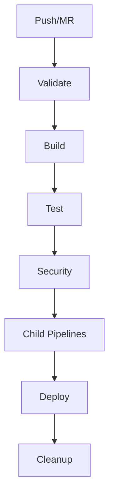
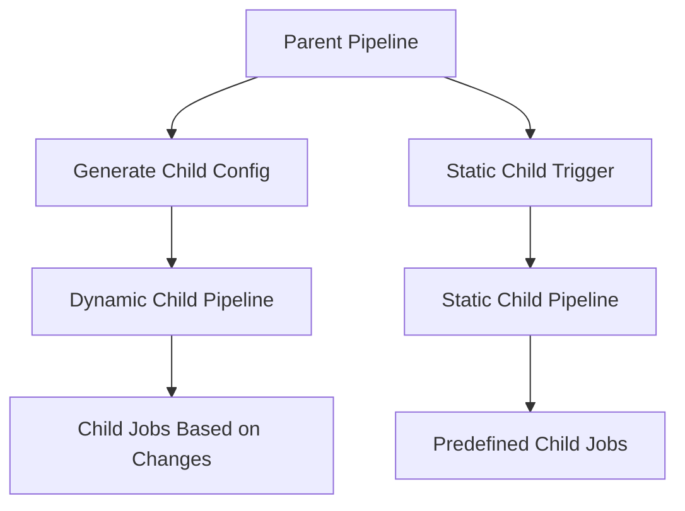
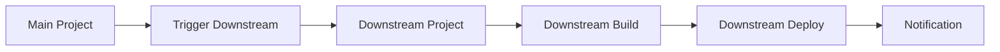

# Lab 12: GitLab CI/CD Workflows

## Overview

This comprehensive lab demonstrates various GitLab CI/CD workflow patterns suitable for learning and implementation in GitLab Community Edition. The lab covers basic pipeline triggers, parent-child pipelines, multi-project pipelines, scheduled pipelines, and advanced workflow patterns.

## Learning Objectives

By completing this lab, you will understand:

1. **Basic Pipeline Triggers**: Push, merge request, manual, and conditional triggers
2. **Parent-Child Pipelines**: Static and dynamic child pipeline configurations
3. **Multi-Project Pipelines**: Cross-project triggers and dependencies
4. **Scheduled Pipelines**: Cron-based scheduling and maintenance jobs
5. **Advanced Workflow Patterns**: Matrix builds, retry mechanisms, environment-based workflows

## Prerequisites

- GitLab Community Edition (CE) installed locally or GitLab.com account
- GitLab Runner configured and registered
- Basic understanding of YAML syntax
- Git knowledge for repository operations
- Docker (optional, for container-based examples)

## Lab Structure

```
lab-12-gitlab-workflows/
├── .gitlab-ci.yml                    # Main pipeline configuration
├── .gitlab/
│   └── ci/
│       ├── rules.yml                 # Reusable rule definitions
│       ├── variables.yml             # Variable templates
│       ├── child-static.yml          # Static child pipeline
│       ├── security.yml              # Security scanning pipeline
│       └── downstream-simulation.yml # Multi-project simulation
├── scripts/
│   ├── generate-child-pipeline.sh    # Dynamic pipeline generator
│   ├── deploy.sh                     # Deployment script
│   └── run-integration-tests.sh      # Integration test script
├── frontend/
│   ├── index.html                    # Sample frontend application
│   ├── styles.css                    # CSS styles
│   └── app.js                        # JavaScript application
├── backend/
│   ├── app.py                        # Sample backend API
│   ├── requirements.txt              # Python dependencies
│   └── tests/                        # Backend tests
└── README.md                         # This documentation
```

## Setup Instructions

### 1. Repository Setup

1. **Clone or create the repository**:
   ```bash
   git clone <repository-url>
   cd lab-12-gitlab-workflows
   ```

2. **Create sample applications** (if not already present):
   ```bash
   # Create frontend directory
   mkdir -p frontend
   
   # Create backend directory
   mkdir -p backend/tests
   
   # Create scripts directory
   mkdir -p scripts
   
   # Create GitLab CI directory structure
   mkdir -p .gitlab/ci
   ```

### 2. GitLab Runner Configuration

Ensure you have at least one GitLab Runner configured:

```bash
# Register a shell runner for local execution
gitlab-runner register \
  --url "http://your-gitlab-instance.com/" \
  --registration-token "your-registration-token" \
  --executor "shell" \
  --description "lab-runner" \
  --tag-list "lab,shell"
```

### 3. Make Scripts Executable

```bash
chmod +x scripts/*.sh
```

### 4. Configure Variables (Optional)

In your GitLab project, go to **Settings → CI/CD → Variables** and configure:

| Variable Name | Value | Description |
|---------------|-------|-------------|
| `ENABLE_MATRIX_BUILDS` | `true/false` | Enable matrix build demonstrations |
| `ENABLE_SECURITY_SCANS` | `true/false` | Enable security scanning jobs |
| `SCHEDULED_JOB_TYPE` | `nightly` | Type of scheduled job to run |

## Running the Lab

### Exercise 1: Basic Pipeline Triggers

1. **Push Trigger Test**:
   ```bash
   # Make a simple change and push
   echo "# Test change" >> README.md
   git add README.md
   git commit -m "Test push trigger"
   git push origin main
   ```
   
   **Expected Result**: Pipeline triggers automatically with validation and build jobs.

2. **Merge Request Trigger**:
   ```bash
   # Create a feature branch
   git checkout -b feature/test-mr
   echo "console.log('MR test');" > frontend/test.js
   git add frontend/test.js
   git commit -m "Add test file for MR"
   git push origin feature/test-mr
   ```
   
   Create a merge request in GitLab UI.
   **Expected Result**: MR-specific jobs run (quality checks).

3. **Manual Trigger**:
   In the GitLab pipeline view, find the `manual-deployment-prep` job and click "Play".
   **Expected Result**: Manual job executes with deployment preparation steps.

### Exercise 2: Parent-Child Pipelines

1. **Static Child Pipeline**:
   Push changes to the main branch and observe the `trigger-static-child` job.
   **Expected Result**: Child pipeline executes with predefined jobs for components A and B.

2. **Dynamic Child Pipeline**:
   Make changes to different directories and push:
   ```bash
   # Make frontend changes
   echo "<h1>Updated</h1>" > frontend/index.html
   
   # Make backend changes  
   echo "print('Updated API')" >> backend/app.py
   
   git add .
   git commit -m "Update frontend and backend"
   git push origin main
   ```
   
   **Expected Result**: Dynamic pipeline generates jobs based on detected changes.

### Exercise 3: Conditional Workflows

1. **File-based Conditions**:
   ```bash
   # Trigger frontend build only
   echo "/* Updated styles */" >> frontend/styles.css
   git add frontend/styles.css
   git commit -m "Update frontend styles"
   git push origin main
   ```
   
   **Expected Result**: Only frontend-related jobs execute.

2. **Variable-based Conditions**:
   Set `ENABLE_MATRIX_BUILDS=true` in project variables, then push a change.
   **Expected Result**: Matrix build jobs execute with multiple configurations.

### Exercise 4: Advanced Patterns

1. **Retry Mechanism**:
   The `flaky-integration-test` job demonstrates retry behavior. It may fail initially and retry automatically.

2. **Matrix Builds**:
   Enable matrix builds and observe parallel job execution with different configurations.

3. **Environment Deployments**:
   Use manual jobs to deploy to staging and production environments.

### Exercise 5: Scheduled Pipelines

1. **Configure Pipeline Schedule**:
   In GitLab UI: **CI/CD → Schedules → New Schedule**
   - Description: "Nightly maintenance"
   - Interval Pattern: `0 2 * * *` (2 AM daily)
   - Variables: `SCHEDULED_JOB_TYPE=nightly`

2. **Test Scheduled Behavior**:
   Manually trigger the schedule or simulate with:
   ```bash
   # Push with schedule simulation
   git commit --allow-empty -m "Test scheduled pipeline [schedule]"
   git push origin main
   ```

## Understanding the Workflows

### Main Pipeline Flow



### Parent-Child Relationship



### Multi-Project Flow



## Troubleshooting

### Common Issues

1. **Pipeline Doesn't Trigger**:
   - Check runner availability
   - Verify `.gitlab-ci.yml` syntax
   - Review pipeline rules and conditions

2. **Child Pipeline Fails**:
   - Check artifact generation in parent job
   - Verify child pipeline YAML syntax
   - Review needs dependencies

3. **Scripts Permission Denied**:
   ```bash
   chmod +x scripts/*.sh
   git add scripts/
   git commit -m "Fix script permissions"
   git push
   ```

4. **Variable Not Found**:
   - Check variable definition in GitLab UI
   - Verify variable scope (project/group)
   - Check variable name spelling

### Debug Commands

Add these to your jobs for debugging:

```yaml
script:
  - echo "Debug Info:"
  - echo "Pipeline ID: $CI_PIPELINE_ID"
  - echo "Pipeline Source: $CI_PIPELINE_SOURCE"
  - echo "Branch: $CI_COMMIT_REF_NAME"
  - echo "Available variables:"
  - env | grep CI_ | sort
```

## Advanced Customization

### Adding New Workflow Patterns

1. **Blue-Green Deployment**:
   - Add environment switching logic
   - Implement traffic routing
   - Add rollback mechanisms

2. **Canary Deployment**:
   - Create percentage-based deployments
   - Add monitoring integration
   - Implement automatic promotion/rollback

3. **Custom Matrix Builds**:
   ```yaml
   test-custom-matrix:
     parallel:
       matrix:
         - OS: ["ubuntu", "alpine", "centos"]
           VERSION: ["18", "20", "22"]
           TEST_TYPE: ["unit", "integration"]
   ```

### Integration Examples

1. **Slack Notifications**:
   ```yaml
   notify-slack:
     script:
       - curl -X POST -H 'Content-type: application/json' \
         --data '{"text":"Pipeline completed"}' \
         $SLACK_WEBHOOK_URL
   ```

2. **External API Integration**:
   ```yaml
   external-trigger:
     script:
       - curl -X POST "$EXTERNAL_API_URL" \
         -H "Authorization: Bearer $API_TOKEN" \
         -d '{"pipeline_id":"'$CI_PIPELINE_ID'"}'
   ```

## Best Practices

1. **Pipeline Design**:
   - Keep jobs focused and single-purpose
   - Use meaningful job names
   - Implement proper error handling
   - Use artifacts efficiently

2. **Security**:
   - Never commit secrets to repository
   - Use GitLab CI/CD variables for sensitive data
   - Implement security scanning
   - Review permissions regularly

3. **Performance**:
   - Use parallel jobs where possible
   - Implement proper caching
   - Optimize Docker image usage
   - Use needs for job dependencies

4. **Maintainability**:
   - Use includes for reusable configurations
   - Document complex logic
   - Use variables for configuration
   - Implement proper testing

## Next Steps

After completing this lab, consider:

1. **Advanced GitLab Features**:
   - GitLab Pages deployment
   - Container Registry integration
   - Package Registry usage
   - GitLab Kubernetes integration

2. **Production Considerations**:
   - Monitoring and alerting
   - Backup and disaster recovery
   - Performance optimization
   - Security hardening

3. **DevOps Integration**:
   - Infrastructure as Code (IaC)
   - Configuration management
   - Service mesh integration
   - Observability implementation

## Resources

- [GitLab CI/CD Documentation](https://docs.gitlab.com/ee/ci/)
- [GitLab Runner Documentation](https://docs.gitlab.com/runner/)
- [GitLab CI/CD Variables](https://docs.gitlab.com/ee/ci/variables/)
- [GitLab CI/CD Examples](https://docs.gitlab.com/ee/ci/examples/)

## Support

For questions or issues with this lab:

1. Check the troubleshooting section
2. Review GitLab CI/CD documentation
3. Examine pipeline logs for error details
4. Test individual jobs in isolation

Remember that this lab is designed for learning purposes. In production environments, additional considerations for security, scalability, and reliability would be necessary.