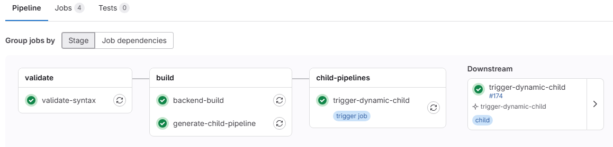

# Lab 13: Child Pipeline Inheritance

## Overview

This lab focuses on **child pipeline inheritance** and demonstrates how parent pipelines can dynamically generate and trigger child pipelines that inherit variables, configurations, and context from their parent.

### Learning Objectives

- Understand parent-child pipeline relationships
- Learn variable and context inheritance patterns
- Master dynamic child pipeline generation
- Implement pipeline orchestration strategies

## Key Concepts

### Child Pipeline Inheritance

Child pipelines automatically inherit:
- **Variables**: Both predefined and runtime variables from parent
- **Project context**: Repository access, permissions, environment
- **Artifacts**: Can access parent pipeline artifacts (with proper configuration)
- **Secrets**: Inherit CI/CD variables and secrets from parent project

### Inheritance Flow

```
Parent Pipeline
├── validate-syntax
├── backend-build  
├── generate-child-pipeline → Creates dynamic child config
└── trigger-dynamic-child → Launches child with inheritance
    └── Child Pipeline
        ├── Inherits PARENT_PIPELINE_ID
        ├── Inherits CHILD_TYPE
        ├── Inherits all project variables
        └── Executes with parent context
```

## Lab Components

### Parent Pipeline Jobs

1. **validate-syntax**: Basic validation and setup
2. **backend-build**: Builds backend components and creates artifacts  
3. **generate-child-pipeline**: Dynamically generates child pipeline YAML
4. **trigger-dynamic-child**: Triggers the child pipeline with variable inheritance

### Child Pipeline Features

The generated child pipeline demonstrates:
- **Variable inheritance**: Access to parent pipeline variables
- **Dynamic configuration**: Generated based on parent pipeline state
- **Artifact dependency**: Can access parent pipeline artifacts
- **Context awareness**: Knows its parent and inheritance chain

## Pipeline Architecture

```yaml
# Parent inherits and passes down:
variables:
  WEB_APP_VERSION: "1.0.0"
  API_VERSION: "2.0.0"
  DOCKER_REGISTRY: "$CI_REGISTRY"

# Child automatically receives:
# - All parent variables
# - PARENT_PIPELINE_ID: $CI_PIPELINE_ID  
# - CHILD_TYPE: "dynamic"
# - Full project context and permissions
```

## Variable Inheritance Patterns

### Automatic Inheritance
- All CI/CD predefined variables
- Project-level variables and secrets
- Group-level variables (if applicable)
- Parent pipeline custom variables

### Explicit Inheritance
```yaml
trigger-dynamic-child:
  variables:
    PARENT_PIPELINE_ID: $CI_PIPELINE_ID    # Explicit parent reference
    CHILD_TYPE: "dynamic"                   # Child type identification
    INHERITED_BUILD_VERSION: $WEB_APP_VERSION # Explicit variable passing
```

### Child Pipeline Access
```yaml
# In child pipeline - automatic access to inherited variables
child-job:
  script:
    - echo "Parent Pipeline: $PARENT_PIPELINE_ID"
    - echo "App Version: $WEB_APP_VERSION"        # Inherited automatically
    - echo "Registry: $DOCKER_REGISTRY"           # Inherited automatically
```

## Getting Started

### Prerequisites
- GitLab instance with CI/CD enabled
- Repository with GitLab Runner configured
- Understanding of basic GitLab CI/CD concepts

### Setup Instructions

1. **Copy the pipeline configuration**:
   ```bash
   cp .gitlab-ci.yml your-project/.gitlab-ci.yml
   ```

2. **Commit and push to trigger**:
   ```bash
   git add .gitlab-ci.yml
   git commit -m "Add child pipeline inheritance lab"
   git push origin main
   ```

3. **Monitor inheritance in GitLab UI**:
   - Go to CI/CD → Pipelines
   - Watch parent pipeline execution
   - Observe child pipeline creation and variable inheritance
   - Check child pipeline job logs for inherited values

## Key Learning Points

### Variable Inheritance Verification

In the child pipeline, verify inheritance by checking:
```bash
# These variables are automatically inherited from parent
echo "Parent ID: $PARENT_PIPELINE_ID"
echo "Project: $CI_PROJECT_NAME"  
echo "Registry: $DOCKER_REGISTRY"
echo "Version: $WEB_APP_VERSION"
```

### Inheritance Chain Tracking

Track the inheritance chain:
```yaml
child-summary:
  script:
    - echo "=== Inheritance Chain ==="
    - echo "Parent Pipeline: $PARENT_PIPELINE_ID"
    - echo "Child Pipeline: $CI_PIPELINE_ID" 
    - echo "Child Type: $CHILD_TYPE"
    - echo "Inherited at: $(date)"
```

### Artifact Inheritance

Child pipelines can access parent artifacts:
```yaml
child-use-parent-artifacts:
  script:
    - echo "Accessing parent artifacts"
    - ls -la dist/backend/    # From parent backend-build job
  needs:
    - pipeline: $PARENT_PIPELINE_ID
      job: backend-build
```

## Advanced Inheritance Patterns

### Conditional Child Triggers
```yaml
trigger-dynamic-child:
  rules:
    - if: $CI_COMMIT_BRANCH == $CI_DEFAULT_BRANCH
    - if: $CI_PIPELINE_SOURCE == "merge_request_event"
  variables:
    ENVIRONMENT: $CI_COMMIT_REF_NAME == $CI_DEFAULT_BRANCH ? "production" : "staging"
```

### Multi-level Inheritance
- Parent → Child → Grandchild pipelines
- Variable inheritance flows down the chain
- Each level can add additional context

### Cross-project Inheritance
```yaml
trigger-external-child:
  trigger:
    project: group/child-project
    strategy: depend
  variables:
    PARENT_PROJECT: $CI_PROJECT_NAME
    PARENT_PIPELINE_ID: $CI_PIPELINE_ID
```

## Troubleshooting

### Common Issues

1. **Variables not inheriting**
   - Check variable scope (project vs. group vs. instance)
   - Verify child pipeline trigger configuration
   - Ensure proper variable naming (no conflicts)

2. **Child pipeline not triggering**
   - Verify artifact generation in `generate-child-pipeline`
   - Check YAML syntax in generated child pipeline
   - Review trigger job `needs` dependencies

3. **Permission issues**
   - Ensure runner has access to both parent and child contexts
   - Check project permissions for child pipeline execution
   - Verify CI/CD variable visibility settings

### Debugging Inheritance

Add debug jobs to verify inheritance:
```yaml
debug-inheritance:
  script:
    - echo "=== All Environment Variables ==="
    - env | grep CI_ | sort
    - echo "=== Custom Variables ==="
    - echo "WEB_APP_VERSION: $WEB_APP_VERSION"
    - echo "PARENT_PIPELINE_ID: $PARENT_PIPELINE_ID"
```

## Best Practices

1. **Explicit Variable Passing**: Always explicitly pass critical variables
2. **Inheritance Documentation**: Document what variables are inherited
3. **Variable Scoping**: Use appropriate variable scopes for inheritance
4. **Error Handling**: Handle cases where inheritance fails
5. **Security**: Be careful with secret inheritance across pipeline boundaries

## Expected Results

After successful execution:
- Parent pipeline completes all 4 jobs
- Child pipeline is dynamically generated and triggered
- Child pipeline inherits all parent variables and context
- Variable values are accessible in child pipeline jobs
- Inheritance chain is clearly traceable

## Next Steps

- Explore multi-level inheritance (grandchild pipelines)
- Implement cross-project pipeline inheritance
- Study artifact inheritance patterns
- Practice conditional inheritance based on branch/environment

## Key Files

- `.gitlab-ci.yml`: Main parent pipeline with inheritance setup
- `scripts/generate-child-pipeline.sh`: Dynamic child pipeline generator
- `generated-child-pipeline.yml`: Runtime-generated child pipeline (artifact)

This lab provides hands-on experience with GitLab's powerful parent-child pipeline inheritance capabilities, essential for complex CI/CD orchestration scenarios.

