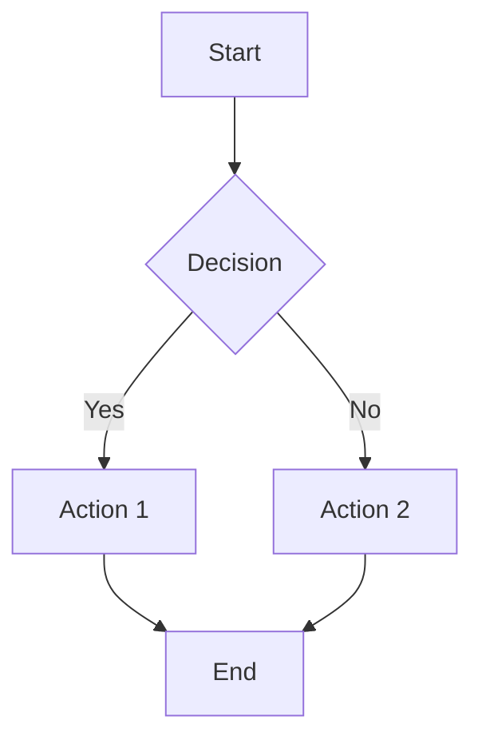
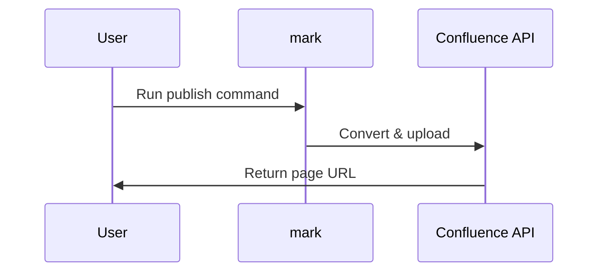

# Sample Document - Mark Publisher Test

**Published using:** `mark` CLI tool  
**Date:** 2026-03-11  
**Author:** Master Yang

---

## 📋 Purpose

This document demonstrates the capabilities of publishing markdown to Confluence using the `mark` CLI tool.

---

## ✨ Supported Features

### Text Formatting

- **Bold text** - Important information
- *Italic text* - Emphasis
- ~~Strikethrough~~ - Deprecated content
- `Inline code` - Technical terms
- Combined: **_Bold and italic_**

### Lists

**Bullet list:**
- Feature 1
- Feature 2
  - Nested item A
  - Nested item B
- Feature 3

**Numbered list:**
1. First step
2. Second step
   1. Sub-step 2.1
   2. Sub-step 2.2
3. Third step

**Task list:**
- [x] Completed task
- [ ] Pending task
- [ ] Future task

---

## 📊 Tables

### Simple Table

| Feature | Status | Priority |
|---------|--------|----------|
| Markdown publishing | ✅ Working | High |
| Image upload | ✅ Working | High |
| Diagram support | ✅ Working | Medium |
| Bulk publish | ✅ Working | Medium |

### Aligned Table

| Left Aligned | Center Aligned | Right Aligned |
|:-------------|:--------------:|--------------:|
| Text         |     Text       |          Text |
| 123          |      456       |           789 |

---

## 💻 Code Blocks

### Python Example

```python
def publish_to_confluence(file_path, space_key):
    """
    Publish markdown file to Confluence.
    
    Args:
        file_path (str): Path to markdown file
        space_key (str): Confluence space key
    
    Returns:
        bool: True if successful
    """
    try:
        result = mark.publish(file_path, space=space_key)
        print(f"✅ Published: {result.page_url}")
        return True
    except Exception as e:
        print(f"❌ Error: {e}")
        return False

# Usage
publish_to_confluence("README.md", "DOCS")
```

### JavaScript Example

```javascript
// Publish document to Confluence
const publishToConfluence = async (filePath, spaceKey) => {
  try {
    const result = await mark.publish({
      file: filePath,
      space: spaceKey,
      parent: 'Documentation'
    });
    console.log(`✅ Published: ${result.pageUrl}`);
    return true;
  } catch (error) {
    console.error(`❌ Error: ${error.message}`);
    return false;
  }
};

// Usage
publishToConfluence('README.md', 'DOCS');
```

### Shell Script Example

```bash
#!/bin/bash
# Publish markdown to Confluence

SPACE="DOCS"
PARENT="Documentation"

for file in *.md; do
  echo "📝 Publishing: $file"
  mark \
    --file "$file" \
    --space "$SPACE" \
    --parent "$PARENT"
  
  if [ $? -eq 0 ]; then
    echo "✅ Success: $file"
  else
    echo "❌ Failed: $file"
  fi
done
```

---

## 🔗 Links

### External Links

- [Confluence Documentation](https://confluence.atlassian.com/doc/)
- [Mark GitHub Repository](https://github.com/kovetskiy/mark)
- [Markdown Guide](https://www.markdownguide.org/)

### Internal Links (Confluence)

- [Another Page](confluence://page-title)
- [Engineering Docs](confluence://engineering/overview)

---

## 🖼️ Images

### External Image


### Local Image (if you have images folder)

<!--  -->

**Note:** Local images require the file to exist in the specified path.

---

## ⚠️ Callouts and Notes

> **📌 Note:** This is a blockquote. Confluence may render this as a note panel.

> **⚠️ Warning:** Important information that requires attention.

> **💡 Tip:** Helpful advice for users.

---

## 📈 Diagram Support

### Mermaid Diagram (if supported)



### Flowchart


### Sequence Diagram



---

## 🎯 Confluence Macros

### Note Macro

<!-- ac:note -->
This is a Confluence note macro.  
It will render as a blue note panel.
<!-- /ac:note -->

### Info Macro

<!-- ac:info -->
📘 This is an info panel.  
Use it for helpful information.
<!-- /ac:info -->

### Warning Macro

<!-- ac:warning -->
⚠️ This is a warning panel.  
Use it for important warnings.
<!-- /ac:warning -->

### Code Macro

<!-- ac:code -->
// Confluence code macro
function example() {
  return "This uses Confluence's native code macro";
}
<!-- /ac:code -->

---

## ✅ Testing Checklist

Use this section to verify all features work:

- [x] Headers (H1-H6)
- [x] Text formatting (bold, italic, strikethrough)
- [x] Lists (bullet, numbered, nested)
- [x] Tables
- [x] Code blocks (syntax highlighting)
- [x] Links (external, internal)
- [x] Images (external, local)
- [x] Blockquotes
- [x] Horizontal rules
- [ ] Mermaid diagrams (depends on Confluence version)
- [x] Confluence macros

---

## 📊 Metadata

**Document Info:**
- **Created:** 2026-03-11
- **Last Updated:** 2026-03-11
- **Version:** 1.0.0
- **Status:** Test Document
- **Tags:** test, markdown, automation

---

## 🚀 Next Steps

1. ✅ Publish this document to Confluence
2. ✅ Verify all formatting renders correctly
3. ✅ Test updating the page (modify and republish)
4. ✅ Try bulk publishing multiple documents
5. ✅ Set up automated publishing via CI/CD

---

## 📝 Notes

- This document is designed to test all major markdown features
- Some features may render differently depending on Confluence version
- Diagrams require Confluence to support Mermaid or similar plugins
- Macros are Confluence-specific and may need adjustment

---

**End of Document**

*Published using `mark` CLI tool - https://github.com/kovetskiy/mark*
